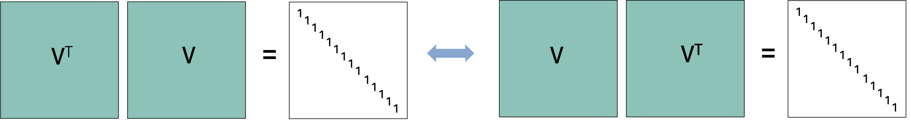
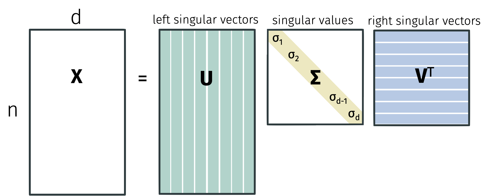
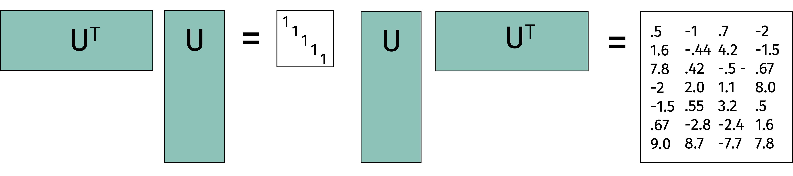
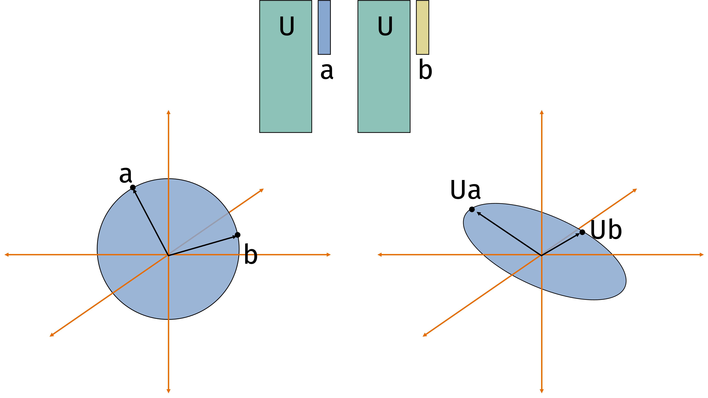
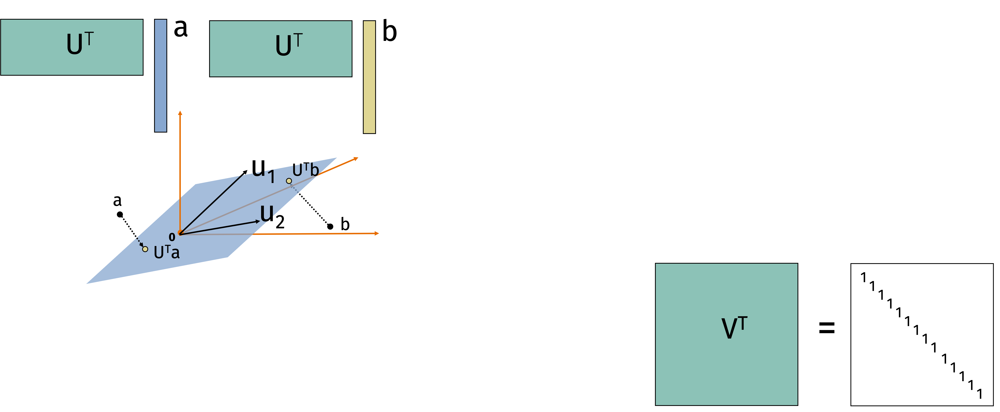
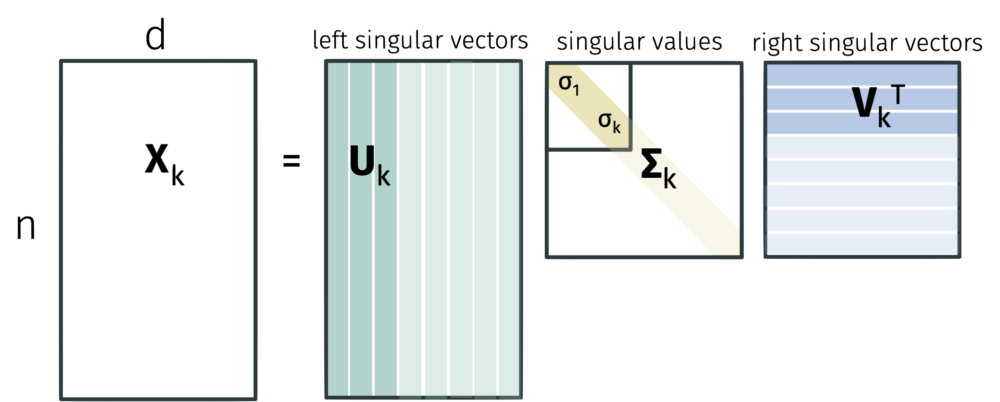
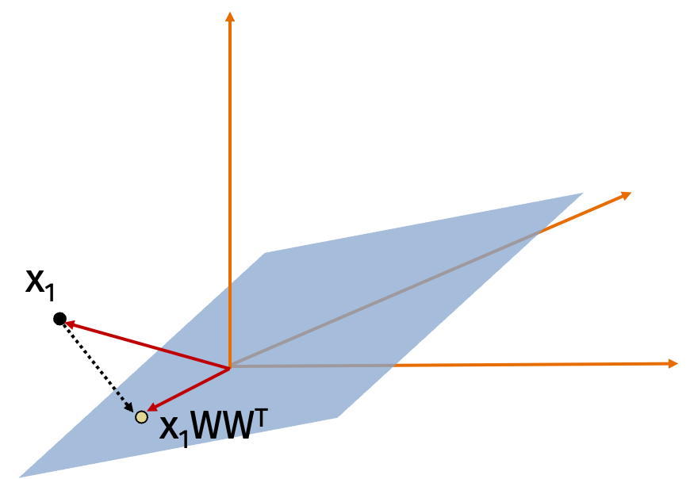
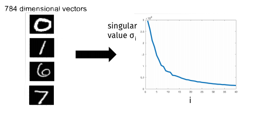
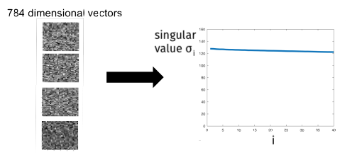

Data science is all about representing data in high dimensions.
But working in high dimensions is difficult computationally, and from an interpretability perspective.
While random data is nearly always far apart, the data we care about often has structure that allows us to find low-dimensional representations of the data that are easier to work with.
We've seen two ways to reduce the dimension of data so far.
The Johnson-Lindenstrauss lemma showed that we can use random projections to reduce the dimensionality of data while preserving pairwise distances.
Locality sensitive hashing showed that we can use a different kind of random map to find similar vectors in sublinear time in the number of vectors we're searching.
Both of these work well but they use random projects rather than taking advantage of the structure in the data.
Today, we'll see how to find the best low-dimensional representation of data by using the singular value decomposition.

## Linear Algebra Tools

### Matrix Multiplication

### Frobenius Norm

### Cyclic Property of the Trace

### Eigendecomposition

### Singular Value Decomposition

## Low Rank Approximations

**Eckart-Young-Mirsky Theorem:**

The next part of this course will cover numerical linear algebra.

## Linear Algebra Review

In this section, we will assume that $\mathbf{X} \in \mathbb{R}^{d \times d}$ is a square and symmetric matrix.
Recall that an eigenvector $\mathbf{v} \in \mathbb{R}^d$ and corresponding eigenvalue $\lambda \in \mathbb{R}$ of $\mathbf{X}$ satisfy $\mathbf{Xv} = \lambda \mathbf{v}$.

The matrix $\mathbf{X}$ has at most $d$ linearly independent eigenvectors.
If it has a full set of $d$ eigenvectors $\mathbf{v}_1, \ldots, \mathbf{v}_d$ where $\|\mathbf{v}_i\|_2 = 1$ for all $i$ and with eigenvalues $\lambda_1 \geq \ldots \geq \lambda_d$, the matrix is called diagonalizable and can be written as
$$
\mathbf{X} = \mathbf{V} \mathbf{\Lambda} \mathbf{V}^{-1}.
$$

Decomposing a matrix into its eigenvectors and eigenvalues is called eigendecomposition.

While eigendecomposition only applies to square matrices, we can extend the idea to rectangular matrices with a related tool called singular value decomposition.
But first, let's review eigendecomposition.

The matrix $\mathbf{V}$ is constructed by placing the orthonormal eigenvectors $\mathbf{v}_1, \ldots, \mathbf{v}_d$ as its columns. Because these column vectors are orthonormal, their dot products are $1$ with themselves and $0$ with each other. That is, $\mathbf{V}^\top \mathbf{V} = \mathbf{I}$.

By definition of an inverse for a square matrix, this implies that $\mathbf{V}^{-1} = \mathbf{V}^\top$.
Finally, because a left inverse is also a right inverse for square matrices, we also have $\mathbf{V} \mathbf{V}^\top = \mathbf{I}$.
This elegantly shows that if a square matrix has orthonormal columns, it also has orthonormal rows.

This implies that, for any vector $\mathbf{x}$, $\| \mathbf{V x}\|_2^2 = \| \mathbf{x} \|_2^2 = \| \mathbf{V}^\top \mathbf{x} \|_2^2$.

To see this, we can write
\begin{align*}
\| \mathbf{V x}\|_2^2
= (\mathbf{V x})^\top (\mathbf{V x})
= \mathbf{x}^\top \mathbf{V}^\top \mathbf{V x}
= \mathbf{x}^\top \mathbf{x}
= \| \mathbf{x} \|_2^2.
\end{align*}
A similar set of steps shows that $\| \mathbf{V}^\top \mathbf{x} \|_2^2 = \| \mathbf{x} \|_2^2$.

We have the same property for the Frobenius norm of a matrix.
For any square matrix $\mathbf{X} \in \mathbb{R}^{d \times d}$, the Frobenius norm $\| \mathbf{X} \|_F^2$ is defined as the sum of squared entries $\sum_{i,j} x_{ij}^2$.
To see that the same property holds for the Frobenius norm, we can write
\begin{align*}
\| \mathbf{V X}\|_F^2
= \sum_{i=1}^d \| \mathbf{V} \mathbf{X}_i \|_2^2
= \sum_{i=1}^d \| \mathbf{X}_i \|_2^2
= \| \mathbf{X} \|_F^2
\end{align*}
where $\mathbf{X}_i$ denotes the $i$th column of $\mathbf{X}$ and the second equality follows from the previous result.
A similar set of steps shows that $\| \mathbf{V}^\top \mathbf{X} \|_F^2 = \| \mathbf{X} \|_F^2$.

## Singular Value Decomposition

Singular value decomposition is one of the most fundamental results in linear algebra.
Without loss of generality, suppose that $n \geq d$.
Any matrix $\mathbf{X} \in \mathbb{R}^{n \times d}$ can be written in the form
$$
\mathbf{X} = \mathbf{U} \mathbf{\Sigma} \mathbf{V}^\top
$$
where $\mathbf{U} \in \mathbb{R}^{n \times d}$, $\mathbf{\Sigma} \in \mathbb{R}^{d \times d}$, and $\mathbf{V} \in \mathbb{R}^{d \times d}$.
The matrix $\mathbf{U}$ satisfies $\mathbf{U}^\top \mathbf{U} = \mathbf{I}$ while $\mathbf{V}$ satisfies $\mathbf{V}^\top \mathbf{V} = \mathbf{I}$.
The matrix $\mathbf{\Sigma}$ is diagonal with non-negative entries $\sigma_1 \geq \sigma_2 \geq \ldots \geq \sigma_d \geq 0$.

Singular values are unique but factors are not.
We would still get a valid decomposition if we multiply the $i$th column of $\mathbf{U}$ and $\mathbf{V}$ by $-1$.

For the eigendecomposition, we showed that $\|\mathbf{V} \mathbf{x}\|_2^2 = \| \mathbf{x} \|_2^2 = \| \mathbf{V}^\top \mathbf{x} \|_2^2$.
It then followed that $\| \mathbf{V} \mathbf{X} \|_F^2 = \| \mathbf{X} \|_F^2$ and $\| \mathbf{V}^\top \mathbf{X} \|_F^2 = \| \mathbf{X} \|_F^2$.
Not all of these properties are true for singular value decomposition.

These properties are not true for rectangular matrices.
Let $\mathbf{U} \in \mathbb{R}^{n \times d}$ with $n > d$ be a matrix with orthonormal columns.
Then $\mathbf{U}^\top \mathbf{U} = \mathbf{I}$ but $\mathbf{U} \mathbf{U}^\top \neq \mathbf{I}$.

Similarly, for any $\mathbf{x} \in \mathbb{R}^d$, $\| \mathbf{U x}\|_2^2 = \| \mathbf{x} \|_2^2$. However, for a vector $\mathbf{y} \in \mathbb{R}^n$, it is generally true that $\| \mathbf{U}^\top \mathbf{y} \|_2^2 \neq \| \mathbf{y} \|_2^2$.

Multiplying a vector by a matrix $\mathbf{U}$ with orthonormal columns rotates and/or reflects the vector.

Multiplying a vector by a matrix $\mathbf{U}^\top$ with orthonormal rows projects the vector into a lower dimensional space (representing it as coordinates in the lower dimensional space).

So we always have that $\| \mathbf{U}^\top \mathbf{x} \|_2 \leq \| \mathbf{x} \|_2$.

An important takeaway from singular value decomposition is how to view matrix multiplication.
We can view multiplying any vector $\mathbf{a}$ by a matrix $\mathbf{X}$ to form $\mathbf{Xa}$ as a composition of three operations:

1. Rotate and/or reflect the vector (multiplication by $\mathbf{V}^\top$).

2. Scale the coordinates (multiplication by $\mathbf{\Sigma}$).

3. Rotate and/or reflect the vector again (multiplication by $\mathbf{U}$).

We can see this because
$$
\mathbf{X a} = \mathbf{U} \left( \mathbf{\Sigma} \left( \mathbf{V}^\top \mathbf{a} \right) \right).
$$

Let's compare singular value decomposition to eigendecomposition.

* Singular value decomposition exists for all matrices (square or rectangular) while eigendecomposition only exists for some square matrices.

* Singular values are always positive while eigenvalues can be positive or negative.

* The factors $\mathbf{U}$ and $\mathbf{V}$ in singular value decomposition have orthogonal columns while the factor $\mathbf{V}$ in eigendecomposition has orthogonal columns if and only if $\mathbf{X}$ is full rank.

We can connect singular value decomposition with eigendecomposition by considering the matrix $\mathbf{X}^\top \mathbf{X}$.
The factor $\mathbf{U}$ contains the orthogonal eigenvectors corresponding to the non-zero eigenvalues of $\mathbf{X} \mathbf{X}^\top$ while the factor $\mathbf{V}$ contains the orthogonal eigenvectors corresponding to the non-zero eigenvalues of $\mathbf{X}^\top \mathbf{X}$.
To see this, recall that
$$
\mathbf{X} = \mathbf{U} \mathbf{\Sigma} \mathbf{V}^\top \text{ and }
\mathbf{X}^\top = \mathbf{V} \mathbf{\Sigma} \mathbf{U}^\top.
$$
Then
\begin{align*}
\mathbf{X}\mathbf{X}^\top
= \mathbf{U} \mathbf{\Sigma} \mathbf{V}^\top \mathbf{V} \mathbf{\Sigma} \mathbf{U}^\top
= \mathbf{U} \mathbf{\Sigma}^2 \mathbf{U}^\top
\end{align*}
and similarly
\begin{align*}
\mathbf{X}^\top \mathbf{X}
= \mathbf{V} \mathbf{\Sigma}^2 \mathbf{V}^\top.
\end{align*}
An additional observation is that the singular values of $\mathbf{X}$ are the square roots of the eigenvalues of $\mathbf{X}^\top \mathbf{X}$ and $\mathbf{X} \mathbf{X}^\top$.
That is, $\sigma_i^2 = \lambda_i(\mathbf{X X}^\top) = \lambda_i(\mathbf{X}^\top \mathbf{X})$.

There are many applications of SVD including:

* Computing the pseudoinverse $\mathbf{V} \mathbf{\Sigma}^{+} \mathbf{U}^\top$.

* Reading off the condition number of $\mathbf{X}$ from the ratio of the largest and smallest singular values.

* Computing matrix norms like $\| \mathbf{X} \|_2 =\sigma_1$ and $\| \mathbf{X} \|_F = \sqrt{\sum_{i=1}^d \sigma_i^2}$.

* Computing the matrix square root $\mathbf{X}^{1/2} = \mathbf{V} \mathbf{\Sigma}^{1/2} \mathbf{U}^\top$.

* Performing principal component analysis.

We'll focus on a particularly useful application called low-rank approximations of $\mathbf{X}$.

## Best Low-Rank Approximation
Low-rank approximations are very useful when our data has some structure.
For example, if a dataset only has $k$ unique data points, it will be exactly rank $k$.
If it has $k$ "clusters" of data points (e.g. the 10 digits in the MNIST dataset), the matrix will often be very close to rank $k$.
Similarly, correlation between columns (data features) leads to a low-rank matrix.

We can exploit low-rank structure by using low-rank approximations to reduce the dimensionality of the data or visualizing the data in a lower dimensional space.
Examples include data embeddings like word2vec or node2vec, reduced order modeling for solving physical equations, constructing preconditioners in optimization, and noisy triangulation.

Because low-rank approximations are so useful, we would like to know how to find the best low-rank approximation to a matrix $\mathbf{X}$.
In fact,
we will show that we can find the best rank-$k$ approximation to $\mathbf{X}$ by computing the singular value decomposition of $\mathbf{X}$ and then setting all but the $k$ largest singular values to zero.

Let $\mathbf{X} = \mathbf{U} \mathbf{\Sigma} \mathbf{V}^\top$ be the singular value decomposition of $\mathbf{X}$.
Let $\mathbf{X}_k$ be the best rank-$k$ approximation to $\mathbf{X}$ i.e.
$$
\mathbf{X}_k = \arg \min_{\text{rank } k \text{ } \mathbf{B}} \| \mathbf{X} - \mathbf{B} \|_F^2.
$$
Define $\mathbf{U}_k$ as the matrix with the first $k$ columns of $\mathbf{U}$, $\mathbf{\Sigma}_k$ as the matrix with the first $k$ singular values of $\mathbf{\Sigma}$ and $\mathbf{V}_k$ as the matrix with the first $k$ columns of $\mathbf{V}$.

**Lemma:**
$$
\mathbf{X}_k = \mathbf{U}_k \mathbf{\Sigma}_k \mathbf{V}_k^\top.
$$

The proof repeatedly uses two observations:

* $\| \mathbf{V} \mathbf{X} \|_F^2 = \| \mathbf{X} \|_F^2$ if $\mathbf{V}^\top \mathbf{V} = \mathbf{I}$ by the connection to $\ell_2$ norm we saw before
and

* $\| \mathbf{X}^\top \|_F^2 = \| \mathbf{X} \|_F^2$ since the Frobenius norm is the sum of squared entries (which is invariant under the transpose operation).

::: {.proof-block}

Proof

**Note:** For the purposes of the proof, we will use the *full* SVD of $\mathbf{X}$, which is $\mathbf{X} = \mathbf{U} \mathbf{\Sigma} \mathbf{V}^\top$ where $\mathbf{U} \in \mathbb{R}^{n \times n}$, $\mathbf{\Sigma} \in \mathbb{R}^{n \times d}$, and $\mathbf{V} \in \mathbb{R}^{d \times d}$.
The first $d$ columns of $\mathbf{U}$ are the same as the $d$ columns of $\mathbf{U}$ in the reduced SVD and the remaining $n-d$ columns of $\mathbf{U}$ are orthogonal to the first $d$ columns and to each other.
The first $d$ rows of $\mathbf{\Sigma}$ are the same as the $d$ rows of $\mathbf{\Sigma}$ in the reduced SVD and the remaining $n-d$ rows of $\mathbf{\Sigma}$ are all zero.
Using the full SVD allows to use that $\mathbf{U}^\top \mathbf{U} = \mathbf{I}$ and $\mathbf{V}^\top \mathbf{V} = \mathbf{I}$.

Then
\begin{align*}
\arg \min_{\text{rank } k \text{ } \mathbf{B}} \| \mathbf{X} - \mathbf{B} \|_F^2
&= \arg \min_{\text{rank } k \text{ } \mathbf{B}} \| \mathbf{U} \mathbf{\Sigma} \mathbf{V}^\top - \mathbf{B} \|_F^2 \\
&= \arg \min_{\text{rank } k \text{ } \mathbf{B}} \| \mathbf{U}^\top ( \mathbf{U} \mathbf{\Sigma} \mathbf{V}^\top - \mathbf{B} ) \mathbf{V} \|_F^2 \\
&= \arg \min_{\text{rank } k \text{ } \mathbf{B}} \| \mathbf{\Sigma} - \mathbf{U}^\top \mathbf{B} \mathbf{V} \|_F^2.
\end{align*}
since $\mathbf{V}^\top \mathbf{V} = \mathbf{I}$.

Then we choose $\mathbf{B}$ so that $\mathbf{U}^\top \mathbf{B} \mathbf{V}$ is the matrix which agrees with $\mathbf{\Sigma}$ on the largest $k$ singular values.
It is intuitive but not obvious that the best rank-$k$ approximation to a diagonal matrix is a diagonal matrix that agrees on the largest $k$ values.

**Claim (Orthogonal Projection):**
Consider any matrix $\mathbf{W} \in \mathbb{R}^{d \times k}$ with orthonormal columns.
Then
$$
\| \mathbf{X} - \mathbf{X W W}^\top \|_F^2
= \| \mathbf{X} \|_F^2 - \| \mathbf{X W W}^\top \|_F^2.
$$

We will prove the orthogonal claim later.
Using the claim,
observe that the problem of finding the best rank $k$ approximation $\mathbf{Z}$ to a diagonal matrix $D$ is equivalent to
\begin{align*}
&\arg \min_{\text{rank $k$ } \mathbf{Z}}
\| \mathbf{D} - \mathbf{Z} \|_F^2 \\
&= \arg \min_{\text{orthonormal rank $k$ } \mathbf{Z}}
\| \mathbf{D}  - \mathbf{D Z Z}^\top \|_F^2 \\
&= \arg \min_{\text{orthonormal rank $k$ } \mathbf{Z}}
\| \mathbf{D} \|_F^2 - \| \mathbf{D Z Z}^\top \|_F^2 \\
&= \arg \max_{\text{orthonormal rank $k$ } \mathbf{Z}}
\| \mathbf{Z}^\top \mathbf{D} \|_F^2 \\
&= \arg \max_{\text{orthonormal rank $k$ } \mathbf{Z}} \sum_{i=1}^d \| \mathbf{Z}_i \|_2^2 \sigma_i^2
\end{align*}
where the second equality follows from the orthogonal projection claim, the third equality follows because $\| \mathbf{D} \|_F^2$ is a constant with respect to $\mathbf{Z}$, and $\mathbf{Z}_i$ is the $i$th row of $\mathbf{Z}$ in the final expression.
Since $\mathbf{Z}$ is orthonormal and rank $k$, we have
$$\sum_{i=1}^d \| \mathbf{Z}_i \|_2^2 = k.$$
To see this, observe that sum of squared row norms is the sum of squared column norms which is $k$.
Since $\mathbf{Z}$ has $k$ orthonormal columns and $d < k$, we have
$$
\| \mathbf{Z}_i \|_2^2 \leq 1.
$$
To see this, imagine "completing" $\mathbf{Z}$ by adding columns to make its rows span the entire space.
After adding the columns, each row would be a unit vector so each row of $\mathbf{Z}$ can have norm at most $1$.
With these observations,
$$
\max_{\text{orthonormal rank $k$ } \mathbf{Z}} \sum_{i=1}^d \| \mathbf{Z}_i \|_2^2 \sigma_i^2
= \sum_{i=1}^d \sigma_i^2
$$
since we want to put as much mass on the larger singular values as possible.

Now that we know the SVD of a diagonal matrix is the best rank-$k$ approximation, we will return to the orthogonal projection claim.
One useful observation of the claim is that
$$
\arg \min_{\mathbf{W} \in \mathbb{R}^{d \times k}}
\| \mathbf{X} - \mathbf{X W W}^\top \|_F^2
= \arg \max_{\mathbf{W} \in \mathbb{R}^{d \times k}} \| \mathbf{X W W}^\top \|_F^2.
$$
Since $\| \mathbf{X} \|_F^2$ is a constant with respect to $\mathbf{W}$, we can maximize $\| \mathbf{X W W}^\top \|_F^2$ to minimize $\| \mathbf{X} - \mathbf{X W W}^\top \|_F^2$.
This is often the perspective people take when thinking about principal component analysis.

We will show the orthogonal claim from the observation that the column $\mathbf{X}_i$ is orthogonal to itself projected onto $\mathbf{W W}^\top$ and then applying the Pythagorean theorem.

The orthogonal projection claim combined with our characterization of the optimal low rank approximation gives us
$$
\| \mathbf{X} - \mathbf{X}_k \|_F^2
= \| \mathbf{X} \|_F^2 - \| \mathbf{X}_k \|_F^2
= \sum_{i=1}^d \sigma_i^2 - \sum_{i=1}^k \sigma_i^2
= \sum_{i=k+1}^d \sigma_i^2.
$$

We can see this because
\begin{align*}
\| \mathbf{X} \|_F^2
= \| \mathbf{U} \mathbf{\Sigma} \mathbf{V}^\top \|_F^2
= \| \mathbf{\Sigma} \mathbf{V}^\top \|_F^2
= \| \mathbf{\Sigma} \|_F^2
\end{align*}
where we used our favorite tricks that $\mathbf{U}^\top \mathbf{U} = \mathbf{I}$, $\mathbf{V}^\top \mathbf{V} = \mathbf{I}$, and the Frobenius norm is invariant with respect to transposes.

:::

The characterization of our low-rank approximation error in terms of the singular values gives a sense of *how* low-rank a matrix is.
Data with structure will have a small number of large singular values and a large number of small singular values.

In contrast, data with no structure will have singular values that are all roughly the same size.

Now that we know the best low-rank approximation is the truncated SVD, all that remains is to find the  SVD.

We can find the SVD with the following approach:

* Compute $\mathbf{X}^\top \mathbf{X}$ in $O(nd^2)$ time.

* Find eigendecomposition of $\mathbf{X}^\top \mathbf{X} = \mathbf{V} \mathbf{\Lambda} \mathbf{V}^\top$ in $O(d^3)$ time using methods like the QR algorithm in $O(d^3)$ time.

* Finally, compute $\mathbf{L} = \mathbf{X V}$ and then set $\sigma_i = \| \mathbf{L}_i \|_2$ and $\mathbf{U}_i = \mathbf{L}_i / \sigma_i$ for $i = 1, \ldots, d$ (provided $\sigma_i \neq 0$) in $O(n d^2)$ time.

The total time complexity is $O(nd^2 + d^3 + nd^2) = O(nd^2)$.
If we use the SVD only for low rank approximation, notice that we didn't really need to find all the singular vectors and values.

We can save time by computing an approximate solution to the SVD.
In particular, we will only compute the top $k$ singular vectors and values.
We can do this with iterative algorithms that achieve time complexity $O(ndk)$ instead of $O(nd^2)$.
There are many algorithms for this problem:

* **Krylov subspace methods** like the Lanczos method are most commonly used in practice.

* **Power method** is the simplest Krylov subspace method and still works very well.

We will focus on the power method next time.

