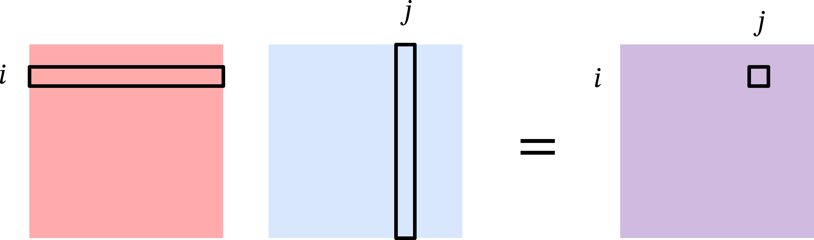
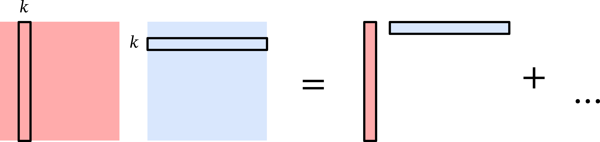

Data science is all about representing data in high dimensions.
But working in high dimensions makes interpreting and computing with data more difficult.

We've seen two methods to reduce the dimension of data so far:
The Johnson-Lindenstrauss lemma showed that we can use random projections to reduce the dimensionality of data while preserving pairwise distances.
Locality sensitive hashing showed that we can use a different kind of random map to find similar vectors in sublinear time in the number of vectors we're searching.
Both of these work well but they use random projections rather than taking advantage of the structure in the data.

Today, we'll see how to find the best low-dimensional representation of data by using the singular value decomposition.

## Linear Algebra Tools

We'll begin by reviewing some linear algebra tools that will be useful for understanding singular value decomposition and its applications.

### Matrix Multiplication

Let $\mathbf{A} \in \mathbb{R}^{m \times n}$ and $\mathbf{B} \in \mathbb{R}^{n \times m}$ be two matrices.
Because their inner dimensions match, we can multiply $\mathbf{A}$ and $\mathbf{B}$ to get a matrix $\mathbf{AB} \in \mathbb{R}^{m \times m}$.
The standard way of viewing matrix multiplication is based on *inner* products.

That is, the $(i,j)$th entry of $\mathbf{AB}$ is the inner product of the $i$th row of $\mathbf{A}$ and the $j$th column of $\mathbf{B}$:
$$
[\mathbf{AB}]_{ij}
= \langle [\mathbf{A}]_{i,:}, [\mathbf{B}]_{:,j} \rangle
= \sum_{k=1}^n [\mathbf{A}]_{i,k} [\mathbf{B}]_{k,j}.
$$

Another way to view matrix multiplication is based on *outer* products.
Let $\mathbf{a}_k$ be the $k$th column of $\mathbf{A}$ and $\mathbf{b}_\ell$ be the $\ell$th row of $\mathbf{B}$.
Then we can write
$$
\mathbf{A} = \sum_{k=1}^n \mathbf{a}_k \mathbf{e}_k^\top
\hspace{3em};
\mathbf{B} = \sum_{\ell=1}^n  \mathbf{e}_\ell \mathbf{b}_\ell^\top
$$
where $\mathbf{e}_k, \mathbf{e}_\ell \in \{0,1\}^n$ are the $k$th and $\ell$th standard basis vector, respectively.

Then the product $\mathbf{AB}$ can be written as
$$
\mathbf{AB} 
= \sum_{k=1}^n \sum_{\ell=1}^n \mathbf{a}_k \mathbf{e}_k^\top \mathbf{e}_\ell \mathbf{b}_\ell^\top
= \sum_{k=1}^n \sum_{\ell=1}^n \mathbf{a}_k \langle \mathbf{e}_k, \mathbf{e}_\ell \rangle \mathbf{b}_\ell^\top
= \sum_{k=1}^n \mathbf{a}_k \mathbf{b}_k^\top,
$$
where we used the fact that $\langle \mathbf{e}_i, \mathbf{e}_j \rangle$ is $1$ if $i = j$ and $0$ otherwise.

We can confirm that these two views of matrix multiplication are consistent with each other by observing that
$$
[\mathbf{AB}]_{ij}
= \left[ \sum_{k=1}^n \mathbf{a}_k \mathbf{b}_k^\top \right]_{ij}
= \sum_{k=1}^n [\mathbf{a}_k]_i [\mathbf{b}_k]_j
= \sum_{k=1}^n [\mathbf{A}]_{i,k} [\mathbf{B}]_{k,j}.
$$

### Frobenius Norm

Let $\mathbf{X} \in \mathbb{R}^{m \times n}$ be a matrix.
Just like we can measure the length of a vector with the $\ell_2$ norm, we can measure the size of a matrix with the Frobenius norm.
The squared Frobenius norm of $\mathbf{X}$ is the sum of squared entries:
$$
\begin{align*}
\| \mathbf{X} \|_F^2
&= \sum_{i=1}^m \sum_{j=1}^n [\mathbf{X}]_{i,j}^2
= \sum_{j=1}^n \sum_{i=1}^m [\mathbf{X}^\top]_{j,i} [\mathbf{X}]_{i,j}
\\&= \sum_{j=1}^n [\mathbf{X}^\top \mathbf{X}]_{j,j}
= \text{tr}(\mathbf{X}^\top \mathbf{X}),
\end{align*}
$$
where $\text{tr}(\mathbf{M})$ is the trace of a square matrix $\mathbf{M}$, which is the sum of the diagonal entries of $\mathbf{M}$.
In words, the Frobenius norm of a matrix is closely related to the trace of the product of the matrix with its transpose.

### Cyclic Property of the Trace

The Frobenius norm gives us a powerful tool for analyzing matrices.
We will see an example of this in the proof of the Eckart-Young-Mirsky theorem, which characterizes the best low-rank approximation to a matrix.
The key tool we will use is the cyclic property of trace.

Let $\mathbf{A} \in \mathbb{R}^{m \times n}$ and $\mathbf{B} \in \mathbb{R}^{n \times m}$ be two matrices.
We will use the linearity of trace and our outer product view of matrix multiplication to show that:
\begin{align*}
\text{tr}(\mathbf{AB}) &= \text{tr}
\left(
  \sum_{k=1}^n \mathbf{a}_k \mathbf{b}_k^\top
\right)
= \sum_{k=1}^n \text{tr}(\mathbf{a}_k \mathbf{b}_k^\top)
= \sum_{k=1}^n \sum_{j=1}^m [\mathbf{a}_k]_j [\mathbf{b}_k]_j
\\&= \sum_{k=1}^n \mathbf{b}_k^\top \mathbf{a}_k
= \sum_{k=1}^n [\mathbf{B} \mathbf{A}]_{k,k}
= \text{tr}(\mathbf{BA}).
\end{align*}

### Eigenvalue Decomposition

Generally, working with matrices is much more challenging than working with scalars.
However, if a matrix has some special structure, we can find a way to work with it more easily.
Consider a square and symmetric matrix $\mathbf{X} \in \mathbb{R}^{d \times d}$.
Because $\mathbf{X}$ is symmetric we know that $\mathbf{X}^\top = \mathbf{X}$.

The matrix $\mathbf{X}$ has $d$ eigenvalues $\lambda_1 \geq \lambda_2 \geq \cdots \geq \lambda_d \in \mathbb{R}$ and corresponding eigenvectors $\mathbf{v}_1, \mathbf{v}_2, \ldots, \mathbf{v}_d \in \mathbb{R}^d$ satisfying
$$
\mathbf{X} \mathbf{v}_i = \lambda_i \mathbf{v}_i.
$$
The eigenvectors of a symmetric matrix are orthonormal, which means that
$$
\langle \mathbf{v}_i, \mathbf{v}_j \rangle
= \begin{cases}
1 & \text{if } i = j, \\
0 & \text{if } i \neq j.
\end{cases}
$$
Using the outer product view of matrix multiplication, we can write $\mathbf{X}$ as
$$
\mathbf{X} = \sum_{i=1}^d \lambda_i \mathbf{v}_i \mathbf{v}_i^\top.
$$
This is called the eigendecomposition of $\mathbf{X}$, and suggests how we can view multiplying $\mathbf{X}$ by a vector $\mathbf{a}$:

1. Project $\mathbf{a}$ onto the eigenvectors of $\mathbf{X}$ (multiplication by $\mathbf{v}_i^\top$).

2. Scale the coordinates (multiplication by $\lambda_i$).

3. Rotate and/or reflect the vector again (multiplication by $\mathbf{v}_i$).

### Singular Value Decomposition

Eigendecomposition only applies to square matrices, but we can extend the idea to rectangular matrices with a related tool called singular value decomposition.

Consider any matrix $\mathbf{X} \in \mathbb{R}^{n \times d}$.
Without loss of generality, suppose that $n \geq d$.
Instead of eigenvalues and eigenvectors, we have singular values $\sigma_1 \geq \sigma_2 \geq \ldots \geq \sigma_d \geq 0$ and corresponding left singular vectors $\mathbf{u}_1, \ldots, \mathbf{u}_d$ and right singular vectors $\mathbf{v}_1, \ldots, \mathbf{v}_d$ satisfying
$$
\mathbf{X} \mathbf{v}_i = \sigma_i \mathbf{u}_i
\hspace{3em}\text{and}\hspace{3em}
\mathbf{u}_i^\top \mathbf{X} = \sigma_i \mathbf{v}_i^\top.
$$
Like the eigenvectors of a symmetric matrix, the left and right singular vectors of a matrix are also orthonormal among themselves.

Using the outer product view of matrix multiplication, we can write $\mathbf{X}$ as
$$
\mathbf{X} = \sum_{i=1}^d \sigma_i \mathbf{u}_i \mathbf{v}_i^\top.
$$
This is called the singular value decomposition of $\mathbf{X}$, and suggests a similar way to view multiplying $\mathbf{X}$ by a vector $\mathbf{a}$.

Notice that we can write
$$
\mathbf{X}^\top \mathbf{X} = \sum_{i=1}^d \sigma_i \mathbf{v}_i \mathbf{u}_i^\top \sum_{j=1}^d \sigma_j \mathbf{u}_j \mathbf{v}_j^\top
= \sum_{i=1}^d \sigma_i^2 \mathbf{v}_i \mathbf{v}_i^\top.
$$

The singular value decomposition is very useful for many applications including:

* Computing the rank of a matrix: $\text{rank}(\mathbf{X}) = \#\{i : \sigma_i > 0\}$.

* Computing the pseudoinverse of a matrix: $\mathbf{X}^+ = \sum_{i=1}^r \frac1{\sigma_i} \mathbf{v}_i \mathbf{u}_i^\top$.

* Computing the condition number of a matrix: $\kappa(\mathbf{X}) = \frac{\sigma_1}{\sigma_d}$.

* Computing matrix norms: $\| \mathbf{X} \|_2 = \sigma_1$ and $\| \mathbf{X} \|_F^2 = \sum_{i=1}^d \sigma_i^2$.

* Finding the best low-rank approximation to a matrix (Eckart-Young-Mirsky theorem).

We will next focus on the last application, which is the basis for principal component analysis and many other dimensionality reduction techniques.

## Low Rank Approximations

In data science applications, we will often have a dataset represented as a matrix $\mathbf{X} \in \mathbb{R}^{n \times d}$ where the rows correspond to data points and the columns correspond to features.

We expect our data to have structure, and this structure often manifests as low-rank structure in the data matrix $\mathbf{X}$.
For example, if a dataset only has $k$ unique data points, it will be exactly rank $k$.
If it has $k$ "clusters" of data points (e.g. the 10 digits in the MNIST dataset), the matrix will often be very close to rank $k$.
Similarly, correlation between columns (data features) leads to a low-rank matrix.

We can exploit low-rank structure by using low-rank approximations to reduce the dimensionality of the data or visualizing the data in a lower dimensional space.
Examples include data embeddings like word2vec or node2vec, reduced order modeling for solving physical equations, constructing preconditioners in optimization, and noisy triangulation.

Today, we will see how to find the best low-rank approximation to a matrix $\mathbf{X}$ using the singular value decomposition of $\mathbf{X}$.

Let $\mathbf{W}  \in \mathbb{R}^{d \times k}$ be a rank-$k$ projection matrix with orthonormal columns.
We will define the best rank $k$ approximation to $\mathbf{X}$ as the matrix:
$$
\mathbf{X}_k = \arg\min_{\mathbf{W} \in \mathbb{R}^{d \times k} : \mathbf{W}^\top \mathbf{W} = \mathbf{I}} \| \mathbf{X} - \mathbf{X} \mathbf{W} \mathbf{W}^\top \|_F^2.
$$

**Eckart-Young-Mirsky Theorem:**
$$
\mathbf{X}_k = \sum_{i=1}^k \sigma_i \mathbf{u}_i \mathbf{v}_i^\top.
$$

::: {.proof-block}

Proof of Eckart-Young-Mirsky Theorem

To show that $\mathbf{X}_k$ is the best rank-$k$ approximation to $\mathbf{X}$, we will first rewrite the objective function in a more convenient form:
$$
\begin{align*}
\| \mathbf{X} - \mathbf{X} \mathbf{W} \mathbf{W}^\top \|_F^2
&= \| \mathbf{X}(\mathbf{I} - \mathbf{W} \mathbf{W}^\top) \|_F^2
\\&= \text{tr} \left( (\mathbf{I} - \mathbf{W} \mathbf{W}^\top)^\top \mathbf{X}^\top \mathbf{X} (\mathbf{I} - \mathbf{W} \mathbf{W}^\top) \right)
\\&= \text{tr} \left( \mathbf{X}^\top \mathbf{X} (\mathbf{I} - \mathbf{W} \mathbf{W}^\top) \right)
\\&= \text{tr}(\mathbf{X}^\top \mathbf{X}) - \text{tr}(\mathbf{X}^\top \mathbf{X} \mathbf{W} \mathbf{W}^\top).
\end{align*}
$$
In the second equality, we used the trace representation of the Frobenius norm, and that the matrix $\mathbf{I} - \mathbf{W} \mathbf{W}^\top$ is symmetric.
In the third equality, we used the cyclic property of the trace, and that $(\mathbf{I} - \mathbf{W} \mathbf{W}^\top)^2 = \mathbf{I} - \mathbf{W} \mathbf{W}^\top$ because $\mathbf{W}$ has orthonormal columns.
Finally, in the last equality, we used the linearity of trace.

When optimizing over $\mathbf{W}$, the first term $\text{tr}(\mathbf{X}^\top \mathbf{X})$ is constant, so we can equivalently write the optimization problem as
$$
\mathbf{X}_k = \arg\max_{\mathbf{W} \in \mathbb{R}^{d \times k} : \mathbf{W}^\top \mathbf{W} = \mathbf{I}} \text{tr}(\mathbf{X}^\top \mathbf{X} \mathbf{W} \mathbf{W}^\top).
$$

We will continue to rewrite the objective function in a more convenient form:
\begin{align*}
\text{tr}(\mathbf{X}^\top \mathbf{X} \mathbf{W} \mathbf{W}^\top)
&= \text{tr}(\mathbf{W}^\top \mathbf{X}^\top \mathbf{X} \mathbf{W})
\\&= \text{tr} \left( \mathbf{W}^\top \left( \sum_{i=1}^d \sigma_i^2 \mathbf{v}_i \mathbf{v}_i^\top \right) \mathbf{W} \right)
\\&= \sum_{i=1}^d \sigma_i^2 \text{tr}(\mathbf{W}^\top \mathbf{v}_i \mathbf{v}_i^\top \mathbf{W})
\\&= \sum_{i=1}^d \sigma_i^2 \| \mathbf{v}_i^\top \mathbf{W} \|_F^2
\\&= \sum_{i=1}^d \sigma_i^2 z_i,
\end{align*}
where $z_i = \| \mathbf{v}_i^\top \mathbf{W} \|_F^2 \geq 0$.
In addition to being non-negative, the $z_i$'s also sum to $k$.
To see this, we can write
\begin{align*}
\sum_{i=1}^d z_i
&= \sum_{i=1}^d \| \mathbf{v}_i^\top \mathbf{W} \|_F^2
= \sum_{i=1}^d \text{tr}(\mathbf{W}^\top \mathbf{v}_i \mathbf{v}_i^\top \mathbf{W})
\\&= \text{tr} \left( \mathbf{W}^\top \left( \sum_{i=1}^d \mathbf{v}_i \mathbf{v}_i^\top \right) \mathbf{W} \right)
= \text{tr}(\mathbf{W}^\top \mathbf{W})
= \text{tr}(\mathbf{I}) = k
\end{align*}
Therefore, optimizing the objective function is equivalent to solving the following optimization problem:
$$
\mathbf{X}_k = \arg\max_{\mathbf{W} \in \mathbb{R}^{d \times k} : \mathbf{W}^\top \mathbf{W} = \mathbf{I}} \sum_{i=1}^d \sigma_i^2 z_i.
$$
Given that $\sigma_1^2 \geq \sigma_2^2 \geq \ldots \geq \sigma_d^2$, the optimal solution is to set $z_i = 1$ for $i \leq k$ and $z_i = 0$ for $i > k$.
This corresponds to choosing $\mathbf{W} = \sum_{j=1}^k \mathbf{v}_j \mathbf{e}_j^\top$, which yields
$$
\begin{align*}
\mathbf{X}_k &= \mathbf{X W W^\top}
= \mathbf{X}
\sum_{j=1}^k \mathbf{v}_j \mathbf{e}_j^\top 
\sum_{\ell=1}^k \mathbf{e}_\ell \mathbf{v}_\ell^\top
\\&= \sum_{i=1}^d \sigma_i \mathbf{u}_i \mathbf{v}_i^\top
\sum_{j=1}^k \mathbf{v}_j \mathbf{v}_j^\top 
= \sum_{i=1}^k \sigma_i \mathbf{u}_i \mathbf{v}_i^\top.
\end{align*}
$$

:::

Notice that we can write the error of the best rank-$k$ approximation as
$$
\| \mathbf{X} - \mathbf{X}_k \|_F^2
=\| \sum_{i=k+1}^d \sigma_i \mathbf{u}_i \mathbf{v}_i^\top \|_F^2
= \text{tr} \left( \sum_{i=k+1}^d \sigma_i^2 \mathbf{v}_i \mathbf{v}_i^\top \right)
=  \sum_{i=k+1}^d \sigma_i^2 \text{tr} \left(\mathbf{v}_i^\top \mathbf{v}_i \right)
= \sum_{i=k+1}^d \sigma_i^2.
$$

The characterization of our low-rank approximation error in terms of the singular values gives a sense of *how* low-rank a matrix is.
Data with structure will have a small number of large singular values and a large number of small singular values.

In contrast, data with no structure will have singular values that are all roughly the same size.

Now that we know the best low-rank approximation is the truncated SVD, all that remains is to find the  SVD.

We can find the SVD with the following approach:

* Compute $\mathbf{X}^\top \mathbf{X}$ in $O(nd^2)$ time.

* Find eigendecomposition of $\mathbf{X}^\top \mathbf{X} = \mathbf{V} \mathbf{\Lambda} \mathbf{V}^\top$ in $O(d^3)$ time using methods like the QR algorithm in $O(d^3)$ time.

* Finally, compute $\mathbf{L} = \mathbf{X V}$ and then set $\sigma_i = \| \mathbf{L}_i \|_2$ and $\mathbf{U}_i = \mathbf{L}_i / \sigma_i$ for $i = 1, \ldots, d$ (provided $\sigma_i \neq 0$) in $O(n d^2)$ time.

The total time complexity is $O(nd^2 + d^3 + nd^2) = O(nd^2)$.
If we use the SVD only for low rank approximation, notice that we didn't really need to find all the singular vectors and values.

We can save time by computing an approximate solution to the SVD.
In particular, we will only compute the top $k$ singular vectors and values.
We can do this with iterative algorithms that achieve time complexity $O(ndk)$ instead of $O(nd^2)$.
There are many algorithms for this problem:

* **Krylov subspace methods** like the Lanczos method are most commonly used in practice.

* **Power method** is the simplest Krylov subspace method and still works very well.

We will focus on the power method next time.
