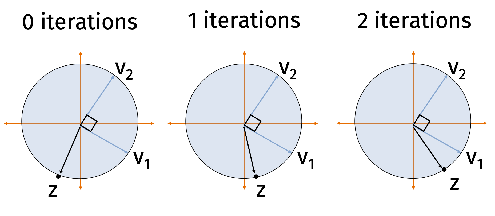
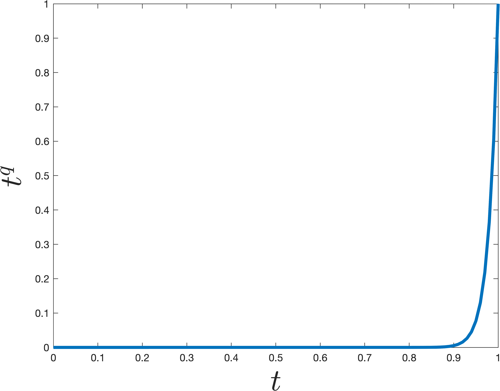
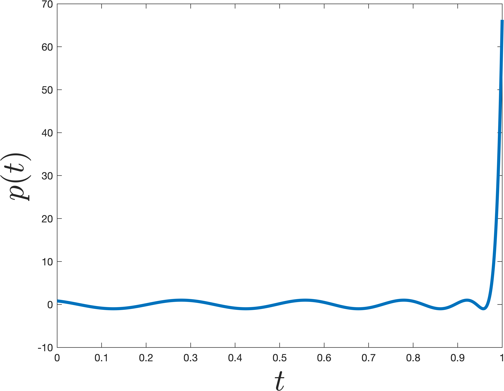

Previously, we used the SVD to find the best rank-$k$ approximation to a matrix $\mathbf{X}$.
For this application, notice that we didn't really need to find all the singular vectors and values.

We can save time by computing an approximate solution to the SVD.
In particular, we will only compute the top $k$ singular vectors and values.
We can do this with iterative algorithms that achieve time complexity $O(ndk)$ instead of $O(nd^2)$.
There are many algorithms for this problem:

* **Krylov subspace methods** like the Lanczos method are most commonly used in practice.
* **Power method** is the simplest Krylov subspace method and still works very well.

The power method is a general algorithm for finding the dominant eigenvector of a square matrix. In the context of computing the SVD of a matrix $\mathbf{X} \in \mathbb{R}^{n\times d}$, we apply the power method to the square, symmetric matrix $\mathbf{A} = \mathbf{X}^\top \mathbf{X} \in \mathbb{R}^{d\times d}$. 

Because $\mathbf{A}$ is symmetric, it has real, non-negative eigenvalues $\lambda_1 \geq \lambda_2 \geq \ldots \geq \lambda_d \geq 0$ and orthonormal eigenvectors $\mathbf{v}_1, \mathbf{v}_2, \ldots, \mathbf{v}_d$. Notice that the eigenvectors of $\mathbf{A}$ are exactly the right singular vectors of $\mathbf{X}$, and its eigenvalues are the squared singular values ($\lambda_j = \sigma_j^2$).

**Power Method:**

* Choose $\mathbf{z}^{(0)}$ randomly. E.g. $\mathbf{z}^{(0)} \sim \mathcal{N}(\mathbf{0}, \mathbf{I}_d)$.
* $\mathbf{z}^{(0)} = \mathbf{z}^{(0)} /\|\mathbf{z}^{(0)}\|_2$
* For $i = 1,\ldots, q$
  * $\mathbf{z}^{(i)} = \mathbf{A} \mathbf{z}^{(i-1)}$
  * $n_i = \|\mathbf{z}^{(i)}\|_2$
  * $\mathbf{z}^{(i)}  = \mathbf{z}^{(i)}/n_i$
* Return $\mathbf{z}^{(q)}$

In other words, each of our iterates $\mathbf{z}^{(i)}$ is simply a scaling of a column in the following matrix:
$$
\mathbf{K} = \begin{bmatrix} \mathbf{z}^{(0)} & \mathbf{A}\mathbf{z}^{(0)} & \mathbf{A}^2 \mathbf{z}^{(0)} & \mathbf{A}^3\mathbf{z}^{(0)} \ldots \mathbf{A}^{q-1} \mathbf{z}^{(0)}\end{bmatrix}.
$$
Typically we run $q \ll d$ iterations, so $\mathbf{K}$ is a tall, narrow matrix. The span of $\mathbf{K}$'s columns is called a **Krylov subspace** because it is generated by starting with a single vector $\mathbf{z}^{(0)}$ and repeatedly multiplying by a fixed matrix $\mathbf{A}$. We will return to $\mathbf{K}$ shortly. 

## Analysis Preliminaries 

Let $\mathbf{v}_1, \ldots, \mathbf{v}_d$ be the orthonormal eigenvectors of $\mathbf{A}$. We can express our initial random vector in terms of this basis:
$$
\mathbf{z}^{(0)} = c_1^{(0)}\mathbf{v}_1 + c_2^{(0)}\mathbf{v}_2 + \ldots + c_d^{(0)} \mathbf{v}_d = \sum_{j=1}^d c_j^{(0)} \mathbf{v}_j
$$
where the coefficients are given by the inner product $c_j^{(0)} = \langle \mathbf{z}^{(0)}, \mathbf{v}_j \rangle = \mathbf{v}_j^\top \mathbf{z}^{(0)}$.

To see what happens when we repeatedly multiply by $\mathbf{A}$, we can rely on our outer product view of matrix multiplication. Recall the eigendecomposition of $\mathbf{A}$:
$$
\mathbf{A} = \sum_{j=1}^d \lambda_j \mathbf{v}_j \mathbf{v}_j^\top
$$

When we compute the next unnormalized iterate, $\mathbf{A} \mathbf{z}^{(i-1)}$, the outer product view makes the operation completely transparent:
$$
\begin{align*}
\mathbf{A} \mathbf{z}^{(i-1)} 
&= \left( \sum_{j=1}^d \lambda_j \mathbf{v}_j \mathbf{v}_j^\top \right) \mathbf{z}^{(i-1)} \\
&= \sum_{j=1}^d \lambda_j \mathbf{v}_j (\mathbf{v}_j^\top \mathbf{z}^{(i-1)}) \\
&= \sum_{j=1}^d \lambda_j c_j^{(i-1)} \mathbf{v}_j
\end{align*}
$$

Because $\mathbf{z}^{(i)} = \frac{1}{n_i} \mathbf{A} \mathbf{z}^{(i-1)}$, we can see exactly how the coefficients update:
$$
c_j^{(i)} = \frac{1}{n_i}\lambda_j c^{(i-1)}_j
$$

Intuitively, we expect the relative size of $c_1^{(i)}$ to **increase** in comparison to the other coefficients as $i$ increases, because $\mathbf{z}^{(q)}$ will start looking more and more like $\mathbf{v}_1$. The $\frac{1}{n_i}$ term is fixed for all $j$, but the $\lambda_j$ term will be largest for $j=1$, and thus $c_1^{(i)}$ will increase in size more than any other term. We will analyze this formally soon.

First however, let's see what it suffices to prove.

**Claim 1**: If $\left|c_j^{(q)}/c_1^{(q)}\right| \leq \sqrt{\epsilon/d}$ for all $j\neq 1$ then either $\|\mathbf{v}_1 -\mathbf{z}^{(q)}\|_2^2\leq 2\epsilon$ or $\|-\mathbf{v}_1 - \mathbf{z}^{(q)}\|_2^2\leq 2\epsilon$. 

::: {.proof-block}

Proof of Claim 1

Since $c_1^{(q)} \leq 1$, the hypothesis implies that $\left|c_j^{(q)}\right| \leq \sqrt{\epsilon/d}$. Since our iterates are unit vectors, $\sum_{k=1}^d \left(c_k^{(q)}\right)^2 = 1$. It follows that $\left(c_1^{(q)}\right)^2 \geq (1-\epsilon)$ and thus $\left|c_1^{(q)}\right| \geq 1-\epsilon$. 

For any unit vector $\mathbf{x}$, we have $\|\mathbf{x} -\mathbf{z}^{(q)}\|_2^2 = 2 - 2\langle\mathbf{x},\mathbf{z}^{(q)}\rangle$. Since $\langle\mathbf{v}_1,\mathbf{z}^{(q)}\rangle = c_1^{(q)}$, we conclude that either $\langle\mathbf{v}_1,\mathbf{z}^{(q)}\rangle \geq 1-\epsilon$ or $\langle- \mathbf{v}_1,\mathbf{z}^{(q)}\rangle \geq 1-\epsilon$. 

Suppose without loss of generality it's the first: $\langle\mathbf{v}_1,\mathbf{z}^{(q)}\rangle \geq 1-\epsilon$. Then we would conclude that:
$$
\|\mathbf{v}_1 -\mathbf{z}^{(q)}\|_2^2 = 2 - 2\langle\mathbf{v}_1,\mathbf{z}^{(q)}\rangle \leq 2 - 2(1-\epsilon) = 2\epsilon.
$$

:::

So, to show the power method converges, our goal is to prove that $\left|c_j^{(q)}/c_1^{(q)}\right| \leq \sqrt{\epsilon/d}$ for all $j\neq 1$. 

## Heart of the Analysis 

To prove this bound, we note that $c_j^{(q)} = S\cdot \lambda_j^{q} c_j^{(0)}$ for any $j$ and $c_1^{(q)} = S\cdot \lambda_1^{q} c_1^{(0)}$ where $S = 1/\prod_{i=1}^q n_i$ is some fixed scaling. So:
$$
\left|\frac{c_j^{(q)} }{c_1^{(q)} }\right| = \left(\frac{\lambda_j}{\lambda_1}\right)^{q} \left|\frac{c_j^{(0)} }{c_1^{(0)} }\right|.
$$

As claimed in class (and can be proven as an exercise—try using rotational invariance of the Gaussian), if $\mathbf{z}^{(0)}$ is a randomly initialized start vector, $\left|\frac{c_j^{(0)} }{c_1^{(0)} }\right| \leq d^{3}$ with high probability. That may seem like a lot, but $(\lambda_j/\lambda_1)^{q}$ is going to be a tiny number, so it will easily cancel that out. In particular, 
$$
\left(\frac{\lambda_j}{\lambda_1}\right)^{q} = \left(1-\frac{\lambda_1-\lambda_j}{\lambda_1}\right)^{q} \leq (1-\gamma)^{q},
$$
where $\gamma = \frac{\lambda_1-\lambda_2}{\lambda_1}$ is our spectral gap parameter. As long as we set 
$$
q = \frac{\log(d^3\sqrt{d/\epsilon})}{\gamma} = O\left(\frac{\log(d/\epsilon)}{\gamma}\right),
$$
then $(1-\gamma)^{q} \leq \frac{\sqrt{\epsilon/d}}{d^3}$, and thus 
$$
\left|\frac{c_j^{(q)} }{c_1^{(q)} }\right| = \left(\frac{\lambda_j}{\lambda_1}\right)^{q} \left|\frac{c_j^{(0)} }{c_1^{(0)} }\right| \leq \frac{\sqrt{\epsilon/d}}{d^3} \cdot d^3 \leq \sqrt{\epsilon/d},
$$
as desired.

## Alternative Guarantee

In machine learning applications, we care less about actually approximating $\mathbf{v}_1$, and more that $\mathbf{z}$ is a "good top singular vector" in that it offers a good rank-1 approximation to $\mathbf{X}$. Using the outer product, we want to prove that the projection matrix error
$$
\|\mathbf{X} - \mathbf{X}\mathbf{z}\mathbf{z}^\top\|_F^2 = \|\mathbf{X}\|_F^2 - \|\mathbf{X}\mathbf{z}\mathbf{z}^\top\|_F^2
$$ 
is small, or equivalently, that $\|\mathbf{X}\mathbf{z}\mathbf{z}^\top\|_F^2$ is large. 

Notice that $\|\mathbf{X}\mathbf{z}\mathbf{z}^\top\|_F^2 = \|\mathbf{X}\mathbf{z}\|_2^2 = \mathbf{z}^\top \mathbf{X}^\top \mathbf{X} \mathbf{z} = \mathbf{z}^\top \mathbf{A} \mathbf{z}$. The largest this could possibly be is $\mathbf{v}_1^\top \mathbf{A} \mathbf{v}_1 = \lambda_1 = \sigma_1^2$. From the same argument above, where we claimed that either $\langle\mathbf{v}_1,\mathbf{z}^{(q)}\rangle \geq 1-\epsilon$ or $\langle- \mathbf{v}_1,\mathbf{z}^{(q)}\rangle \geq 1-\epsilon$, it is not hard to check that:
$$
\|\mathbf{X}\mathbf{z}\mathbf{z}^\top\|_F^2 \geq (1-\epsilon) \sigma_1^2,
$$ 
so after $O\left(\frac{\log(d/\epsilon)}{\gamma}\right)$ iterations we get a near optimal low-rank approximation. 

## The Lanczos Method  

We will now see how to improve on the power method using what is known as the Lanczos method. Like the power method, Lanczos is considered a **Krylov subspace method** because it will return a solution **in the span of the Krylov subspace** that we introduced before. 

The power method clearly does this—it returns a scaling of the last column of $\mathbf{K}$. The whole idea behind Lanczos is to avoid "throwing away" information from earlier columns like the power method, but instead to take advantage of the whole space. It turns out that doing so can be very helpful; we will get a bound that depends on $1/\sqrt{\gamma}$ instead of $1/\gamma$. 

Specifically, to define the Lanczos method, we will let $\mathbf{Q}\in \mathbb{R}^{d\times q}$ be a matrix with orthonormal columns that spans $\mathbf{K}$. In practice, you need to be careful about how this is computed for numerical stability reasons, but we won't worry about that for now. Imagine your computer has infinite precision and we just compute $\mathbf{Q}$ by orthonormalizing $\mathbf{K}$. 

**Lanczos Method**

* Compute an orthonormal span $\mathbf{Q}$ for the degree $q$ Krylov subspace. 
* Let $\mathbf{z}$ be the top eigenvector of $\mathbf{Q}^\top \mathbf{A}\mathbf{Q}$. 
* Return $\mathbf{Q} \mathbf{z}$. 

Importantly, the first step only requires $q$ matrix-vector multiplications with $\mathbf{A}$, each of which can be implemented in $O(nd)$ time (if $\mathbf{A} = \mathbf{X}^\top \mathbf{X}$, we multiply by $\mathbf{X}$ then $\mathbf{X}^\top$). The second step might look a bit circular at first glance. We want an approximation algorithm for computing the top eigenvector of $\mathbf{A}$, and the above method uses a top eigenvector algorithm as a subroutine. But note that $\mathbf{Q}^\top \mathbf{A}\mathbf{Q}$ only has size $q\times q$, where $q\ll d$ is our iteration count. So even if it's too expensive to compute a direct eigendecomposition of $\mathbf{A}$, $\mathbf{Q}^\top\mathbf{A}\mathbf{Q}$ can be computed in $O(q^3)$ time.

## Analysis Preliminaries 

Our first claim is that Lanczos returns the *best* approximate eigenvector in the span of the Krylov subspace. Then we will argue that there always exists *some* vector in the span of the subspace that is significantly better than what the power method returns, so the Lanczos solution must be significantly better as well.  

**Claim 2**: Amongst all vectors in the span of the Krylov subspace (i.e., any vector $\mathbf{y}$ that can be written as $\mathbf{y} = \mathbf{Q}\mathbf{x}$ for some $\mathbf{x}\in \mathbb{R}^q$), $\mathbf{y}^* = \mathbf{Q}\mathbf{z}$ maximizes $\mathbf{y}^\top \mathbf{A} \mathbf{y}$ (which minimizes the low-rank approximation error $\|\mathbf{X} - \mathbf{X}\mathbf{y}\mathbf{y}^\top\|_F^2$). 

::: {.proof-block}

Proof of Claim 2

First, we can prove that $\mathbf{y}$ should always be chosen to have unit norm, so that $\mathbf{y}\mathbf{y}^\top$ is a projection matrix (an outer product representing projection onto $\mathbf{y}$). Accordingly, it must also be that $\mathbf{x} = \mathbf{Q}^\top\mathbf{y}$ has unit norm because $\mathbf{Q}$ has orthonormal columns. 

Proving the claim above is equivalent to proving that $\mathbf{y}^* = \mathbf{Q}\mathbf{z}$ maximizes $\mathbf{y}^\top \mathbf{A} \mathbf{y} = (\mathbf{Q}\mathbf{x})^\top \mathbf{A} (\mathbf{Q}\mathbf{x}) = \mathbf{x}^\top (\mathbf{Q}^\top \mathbf{A} \mathbf{Q}) \mathbf{x}$. By the definition of eigenvectors, the unit vector $\mathbf{x}$ that maximizes this quadratic form is exactly the top eigenvector of $\mathbf{Q}^\top \mathbf{A} \mathbf{Q}$.

:::

**Claim 3**: If we run the Lanczos method for $O\left(\frac{\log(d/\epsilon)}{\sqrt{\gamma}}\right)$ iterations, there is *some* vector $\mathbf{w}$ of the form $\mathbf{w} = \mathbf{Q}\mathbf{x}$ such that either $\langle\mathbf{v}_1,\mathbf{w}\rangle \geq 1-\epsilon$ or $\langle- \mathbf{v}_1,\mathbf{w}\rangle \geq 1-\epsilon$. 

In other words, there is some $\mathbf{w}$ in the Krylov subspace that has a large inner product with the true top eigenvector $\mathbf{v}_1$. As seen earlier for the power method, this can be used to prove that e.g. $\mathbf{w}^\top \mathbf{A} \mathbf{w}$ is large, and from **Claim 2**, we know that the vector returned by Lanczos can only do better. So, we focus on proving **Claim 3**. 

## Heart of the Analysis 

The key idea is to observe that any vector in the span of the Krylov subspace of size $q$—i.e., any vector $\mathbf{w}$ that can be written $\mathbf{w} = \mathbf{Q}\mathbf{x}$—is equal to:
$$
\mathbf{w} = p(\mathbf{A})\mathbf{z}^{(0)},
$$
for some **degree $q-1$ polynomial** $p$. For example, we might have $p(\mathbf{A}) = 2\mathbf{A}^2 - 4\mathbf{A}^3 + \mathbf{A}^6$. For any degree $q-1$ polynomial $p$, there is *some* $\mathbf{x}$ such that $\mathbf{Q}\mathbf{x} = p(\mathbf{A})\mathbf{z}^{(0)}$. This is because all monomials $\mathbf{z}^{(0)}, \mathbf{A}\mathbf{z}^{(0)}, \ldots, \mathbf{A}^{q-1}\mathbf{z}^{(0)}$ lie in the span of $\mathbf{Q}$, so any linear combination does as well. 

This means that finding a good approximate top eigenvector $\mathbf{w}$ in the span of the Krylov subspace reduces to finding a **good polynomial $p(\mathbf{A})$**. 

Using our outer product expansion of $\mathbf{A} = \sum_{j=1}^d \lambda_j \mathbf{v}_j \mathbf{v}_j^\top$, we know that applying a polynomial to a matrix simply applies that polynomial to its eigenvalues:
$$
p(\mathbf{A}) = \sum_{j=1}^d p(\lambda_j) \mathbf{v}_j \mathbf{v}_j^\top
$$

Therefore, when we multiply this polynomial matrix by our initial vector $\mathbf{z}^{(0)}$, the outer product isolates the coordinates exactly as we saw in the power method:
$$
\begin{align*}
p(\mathbf{A})\mathbf{z}^{(0)} 
&= \left( \sum_{j=1}^d p(\lambda_j) \mathbf{v}_j \mathbf{v}_j^\top \right) \mathbf{z}^{(0)} \\
&= \sum_{j=1}^d p(\lambda_j) (\mathbf{v}_j^\top \mathbf{z}^{(0)}) \mathbf{v}_j \\
&= \sum_{j=1}^d p(\lambda_j) c_j^{(0)} \mathbf{v}_j
\end{align*}
$$

Letting $g_j = c_j^{(0)}p(\lambda_j)$, our goal is identical to the power method: we want to show that $g_1$ is *much larger* than $g_j$ for all $j \neq 1$. In other words, we want to find a polynomial such that $p(t)$ is small for all values of $0\leq t< \lambda_1$, but then suddenly **jumps** to be large at $\lambda_1$. 

The simplest degree $q$ polynomial that does this is $p(t) = t^q$ (which is exactly what the power method uses). However, it turns out there are more *sharply* jumping polynomials, which can be obtained by shifting/scaling a type of polynomials known as a [Chebyshev polynomial](https://en.wikipedia.org/wiki/Chebyshev_polynomials). An example that jumps at $1$ is shown below. The difference from $t^q$ is remarkable—even though the polynomial $p$ shown below is nearly as small for all $0\leq t< 1$, it is much larger at $t=1$. 

Concretely we can claim the following, which is a bit tricky to prove, but well known (see [Lemma 5 here](https://arxiv.org/pdf/1504.05477.pdf) for a full proof).

**Claim 4:** There is a degree $O\left(\sqrt{\frac{1}{\gamma}}\log\frac{d}{\epsilon}\right)$ polynomial $\hat{p}$ such that $\hat{p}(1) = 1$ and $|\hat{p}(t)| \leq \epsilon$ for $0 \leq t \leq 1-\gamma$. 

In contrast, to ensure that $t^q$ satisfies the above, we would need degree $q = O\left({\frac{1}{\gamma}\log\frac{d}{\epsilon}}\right)$—a quadratically worse bound. This accounts for the quadratic difference in performance between the Lanczos and Power Methods. 

## Finishing Up

Finally, we use **Claim 4** to finish the analysis of Lanczos. Consider the vector $\hat{p}\left(\frac{1}{\lambda_1}\mathbf{A}\right)\mathbf{z}^{(0)}$, which as argued above lies in the Krylov subspace. As discussed before, our job is to prove that:
$$
\left| \frac{c_j^{(0)}\hat{p}\left(\frac{\lambda_j}{\lambda_1}\right)}{c_1^{(0)}\hat{p}\left(\frac{\lambda_1}{\lambda_1}\right)} \right| \leq \sqrt{\epsilon/d},
$$
for all $j \neq 1$, as long as $\hat{p}$ is chosen to have degree $q = O\left(\sqrt{\frac{1}{\gamma}}\log\frac{d}{\epsilon}\right)$. 

Consider the input to the polynomial in the numerator: 
$$
\frac{\lambda_j}{\lambda_1} = 1 - \left(1 - \frac{\lambda_j}{\lambda_1}\right) \leq 1 - \frac{\lambda_1 - \lambda_2}{\lambda_1} = 1-\gamma
$$

Accordingly, if we set $q = O\left(\sqrt{\frac{1}{\gamma}}\log\frac{1}{\epsilon'}\right)$ where $\epsilon' = \frac{\sqrt{\epsilon/d}}{d^3}$, then $\hat{p}\left(\frac{\lambda_j}{\lambda_1}\right) \leq \epsilon'$. The denominator is simply equal to $c_1^{(0)}\hat{p}(1) = c_1^{(0)}\cdot 1$. 

Since $\left|c_j^{(0)}/c_1^{(0)}\right|\leq d^3$ with high probability, as argued earlier, the inequality holds. Thus **Claim 3** is proven by setting $\mathbf{w} = \hat{p}\left(\frac{1}{\lambda_1} \mathbf{A} \right)\mathbf{z}^{(0)}$.